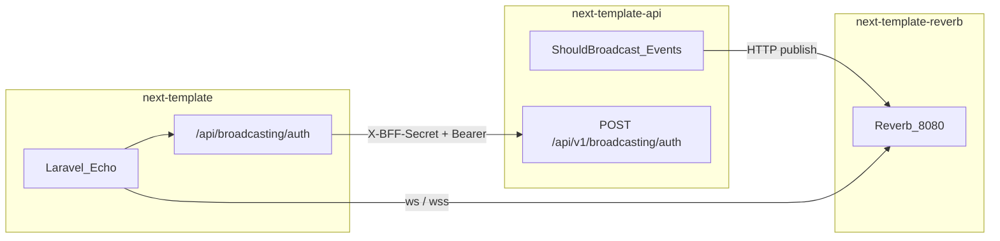

# next-template Reverb

Dedicated [Laravel Reverb](https://laravel.com/docs/13.x/reverb) WebSocket process for the next-template stack. This repository only runs `php artisan reverb:start`. It does not publish events or authorize channels.

| Repo | Role |
|------|------|
| **next-template-reverb** (this repo) | WebSocket server. Source of truth for `REVERB_APP_*`. |
| **next-template-api** | Publisher (`BROADCAST_CONNECTION=reverb` + `pusher/pusher-php-server`). Passport channel auth at `POST /api/v1/broadcasting/auth`. Do **not** install `laravel/reverb` there. |
| **next-template** (Next.js) | Laravel Echo in the browser. Private channels authenticate through the BFF (`POST /api/broadcasting/auth`), which attaches the Passport bearer token. |



## Local development

```bash
cp .env.example .env
php artisan key:generate

# Set REVERB_APP_ID, REVERB_APP_KEY, REVERB_APP_SECRET
# Copy the same values to next-template-api.
# Copy the public key/host/port/scheme to Next as NEXT_PUBLIC_REVERB_*.

php artisan reverb:start --debug
```

Reverb listens on `ws://localhost:8080`. `REVERB_ALLOWED_ORIGINS` must list the Next.js hostname (`localhost`), not this WebSocket host.

## Docker

```bash
cp .env.example .env
docker compose up --build
```

Or:

```bash
docker build -t next-template-reverb .
docker run -p 8080:8080 --env-file .env next-template-reverb
```

Inject secrets at runtime. Do not bake them into the image.

## Environment variables

| Variable | Purpose |
|----------|---------|
| `REVERB_APP_ID` | Application ID (shared with the API) |
| `REVERB_APP_KEY` | Public key (`NEXT_PUBLIC_REVERB_APP_KEY` on Next) |
| `REVERB_APP_SECRET` | Signs API publish requests. Never expose to the browser. |
| `REVERB_SERVER_HOST` | Bind address (`0.0.0.0` in Docker) |
| `REVERB_SERVER_PORT` | Bind port (`8080`) |
| `REVERB_HOST` | Public hostname the API and Echo use |
| `REVERB_PORT` | Public port (`8080` local, `443` behind TLS) |
| `REVERB_SCHEME` | `http` locally, `https` in production |
| `REVERB_ALLOWED_ORIGINS` | Bare hostnames of the Next.js app |

## Production (Coolify)

- Terminate TLS at the proxy and forward WebSocket traffic to container port `8080`.
- Healthcheck the Reverb HTTP port (the process is Reverb, not `artisan serve`).
- Set `REVERB_HOST` to the public WSS hostname, `REVERB_PORT=443`, `REVERB_SCHEME=https`.
- Set `REVERB_ALLOWED_ORIGINS` to the production Next.js hostname.
- Mirror `REVERB_APP_*`, `REVERB_HOST`, `REVERB_PORT`, and `REVERB_SCHEME` on the API. Do not run `reverb:start` in the API image.
- Optional later: `REVERB_SCALING_ENABLED=true` plus a shared Redis when running more than one replica.

## Documentation

- [Laravel Broadcasting](https://laravel.com/docs/13.x/broadcasting)
- [Laravel Reverb](https://laravel.com/docs/13.x/reverb)

## License

The Laravel framework is open-sourced software licensed under the [MIT license](https://opensource.org/licenses/MIT).
